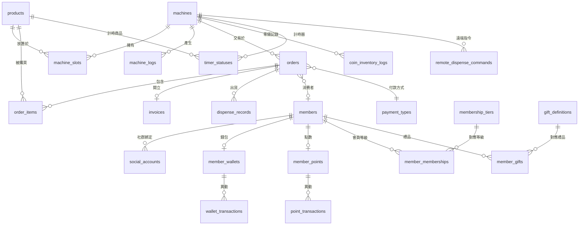

# Star Cloud API 分析與資料庫結構整理

> 基於 `docs/API/` 中 12 個 PDF 文件的完整分析，整理出 API 端點清單、資料流向及推導出的資料庫結構。

---

## 一、API 端點總覽

| 代碼 | 名稱 | URL | Method | 說明 |
|------|------|-----|--------|------|
| B010 | 機台狀態上傳 & 指令撈回 | `/api/app/machine/status/{workid}` | POST | 機台定期心跳上報（狀態、溫度、門禁、版本），並撈回遠端指令。詳見 [b010_technical_spec.md](file:///home/mama/projects/star-cloud/docs/b010_technical_spec.md) |
| B017 | 遠端改庫存 | `/api/app/machine/reload_msg/{workid}` | POST | 機台撈取最新貨道庫存數量。詳見 [b017_technical_spec.md](file:///home/mama/projects/star-cloud/docs/b017_technical_spec.md) |
| B055 | 遠端出貨（取得指令） | `/api/app/machine/dispense/{workid}` | POST | 機台撈取遠端出貨指令列表。詳見 [b055_technical_spec.md](file:///home/mama/projects/star-cloud/docs/b055_technical_spec.md) |
| B055 | 遠端出貨（狀態回傳） | `/api/app/machine/dispense/{workid}` | PUT | 機台回報出貨結果（成功/失敗）及剩餘庫存。詳見 [b055_technical_spec.md](file:///home/mama/projects/star-cloud/docs/b055_technical_spec.md) |
| B220 | 零錢機庫存變動回傳 | `/api/app/coin/inventory/B220` | POST | 零錢機各面額庫存回傳（1/5/10/50/100/500/1000 元）。詳見 [b220_technical_spec.md](file:///home/mama/projects/star-cloud/docs/b220_technical_spec.md) |
| B600 | 消費金流回傳 | `/api/app/B600` | POST | 消費交易核心 API — 記錄金流類型、金額、商品、發票、會員等。詳見 [b600_technical_spec.md](file:///home/mama/projects/star-cloud/docs/b600_technical_spec.md) |
| B601 | 發票資訊回傳 | `/api/app/B601` | POST | 開立發票後回傳發票號碼、日期、隨機碼等。詳見 [b601_technical_spec.md](file:///home/mama/projects/star-cloud/docs/b601_technical_spec.md) |
| B602 | 出貨回傳 | `/api/app/B602` | POST | 出貨結果回傳（商品、貨道、金額、庫存、會員條碼等）。詳見 [b602_technical_spec.md](file:///home/mama/projects/star-cloud/docs/b602_technical_spec.md) |
| B650 | 驗證會員 | `/api/app/B650` | POST | 會員驗證（點數折抵、優惠券、取貨碼、線上訂單線下取貨等）。詳見 [b650_technical_spec.md](file:///home/mama/projects/star-cloud/docs/b650_technical_spec.md) |
| B710 | 計時器狀態回傳 | `/api/app/B710` | POST | 計時型機台的貨道使用狀態與倒數秒數回傳。詳見 [b710_technical_spec.md](file:///home/mama/projects/star-cloud/docs/b710_technical_spec.md) |

---

## 二、API 詳細分析

### 2.1 B010 — 機台狀態上傳 & 指令撈回

**用途**：機台定期向 Cloud 回報自身狀態，Cloud 透過 response 中的 `status` 碼下發遠端指令。

**Request 欄位**：

| 欄位 | 說明 |
|------|------|
| `key` | API 金鑰 (`KahnEwjhfDBHUYS7`) |
| `machine` | 機台序號 |
| `door` | 門禁狀態（非必填） |
| `temperature` | 溫度 |
| `M_Stus` | 機台型號（非必填） |
| `M_Stus2` | 當前頁面狀態碼 |
| `M_Ver` | 當前軟體版本 |

**頁面狀態碼 (M_Stus2)**：
- `0`: 離線, `1`: 主頁面, `2`: 販賣頁, `3`: 管理頁, `4`: 補貨頁, `5`: 教學頁
- `6`: 購買中, `7`: 鎖定頁, `60`: 出貨成功, `61`: 貨道測試, `62`: 付款選擇
- `63`: 等待付款, `64`: 出貨, `65`: 收據簽單, `66`: 通行碼, `67`: 取貨碼
- `68`: 訊息顯示, `69`: 取消購買, `610`: 購買結束, `611`: 來店禮, `612`: 出貨失敗

**遠端指令碼 (Response status)**：
- `49`: reload B017 (重新載入庫存), `50`: reload B005, `51`: reboot (重啟)
- `60`: reboot card machine, `61`: checkout, `70`: unlock, `71`: lock
- `72`: sellCode reload B023, `75`: exp reload B026, `79`: read B050
- `81`: sync timer status (B710), `85`: reload B055 (遠端出貨)

---

### 2.2 B600 — 消費金流回傳（核心交易 API）

**用途**：記錄每筆消費交易的完整資訊，為最核心的銷售數據 API。

**Request 欄位**：

| 欄位 | 參數名 | 說明 | 類型 |
|------|--------|------|------|
| req1 | key | API 金鑰 | String |
| req2 | machine | 機台編號 | String |
| req3 | payment_type | 金流類型代碼 | String |
| req4 | payment_request | 金流送出 data | String |
| req5 | payment_response | 金流回傳 data | String |
| req6 | product_id | 商品 ID | String |
| req7 | amount | 消費金額 | String |
| req8 | invoice_info | 發票歸戶資訊（統編-電話） | String |
| req9 | order_no | APP 定義訂單編號 | String |
| req10 | member_barcode | 掃會員得到的條碼 | String |
| req11 | machine_time | 機台時間 | String |
| req12 | status | 金流狀態 (0: 失敗, 1: 成功, 2: 50 結帳) | String |
| req13 | change_amount | 找零金額 | String |
| req14 | points_used | 使用的點數 | String |
| req15 | reserved | 系統保留 | String |
| req16 | items | 商品明細 `[{pid, amount, num}]` | JsonArray |

**金流類型 (req3) 完整對照**：

| 代碼 | 說明 |
|------|------|
| 1 | 信用卡 |
| 2 | 悠遊卡/一卡通 |
| 3 | 掃碼支付 |
| 4 | 手機支付 |
| 5 | 通行碼 |
| 6 | 取貨碼 |
| 7 | 來店禮 |
| 8 | 問卷 |
| 9 | 零錢 |
| 21-25 | 線下付款 + (1/2/3/4/9) |
| 30-34 | TapPay (Line/街口/悠遊付/Pi/全盈+) |
| 40 | 會員驗證取貨商品 |
| 41 | 線上訂單線下結帳 |
| 50-54 | 線下付款 + TapPay 系列 |
| 60 | 點數/優惠券全額折抵 |
| 61-64, 69 | 會員 + (1/2/3/4/9) |
| 70 | 官方 LinePay |
| 90-94 | 會員 + TapPay 系列 |
| 101-109 | 大豐環保點數 + 消費 |
| 110-114, 120 | 大豐環保 + TapPay/LinePay |

---

### 2.3 B650 — 驗證會員

**驗證類型 (req6)**：

| req6 | 說明 | Response 特殊欄位 |
|------|------|--------------------|
| 0 | 有點擊商品的驗證 | `userToken`, `amount`, `point`, `respondMSG` |
| 1 | 會員純驗證 | 基本驗證回應 |
| 2 | 會員兌換商品列表 | `productList[{pId, pName, token, validityPeriod, num}]` |
| 3 | 線上訂單線下結帳 | `orderUrl`, `orderNumber`, `orderAmount` |
| 4 | 會員贈品 | — |

**Response 狀態碼**：
- `100`: 成功 — 無可用點數
- `101`: 成功 — 全額折抵（點數或優惠券）
- `102`: 成功 — 部分折抵
- `103`: 取貨碼驗證成功
- `104`: 線上訂單驗證成功
- `21`: Key Error, `22`: Time Error, `23`: User Token Error
- `25`: 會員平台錯誤, `30`: 會員正在其他機台使用中
- `35`: 無效優惠券, `40`: 已兌換過, `41`: 無效訂單, `42`: 取貨碼錯誤

---

## 三、資料庫結構推導

根據以上 API 的欄位分析，以下是系統需要的**完整資料庫結構**：

### 🟢 已存在的資料表（比對現有 migration）

| 資料表 | 說明 | 對應 API |
|--------|------|----------|
| `users` | 後台管理員 | — |
| `machines` | 機台基本資料 | B010, B017, B055, B220, B600, B602 |
| `machine_logs` | 機台日誌 | B010 |
| `app_configs` | APP 設定 | — |
| `members` | 會員資料 | B650 |
| `social_accounts` | 社群帳號 | B650 |
| `member_wallets` | 會員錢包 | B650 |
| `wallet_transactions` | 錢包交易 | B600, B650 |
| `member_points` | 點數帳戶 | B650 |
| `point_transactions` | 點數異動 | B650, B600 |
| `point_rules` | 點數規則 | B650 |
| `membership_tiers` | 會員等級 | — |
| `member_memberships` | 會員等級紀錄 | — |
| `gift_definitions` | 禮品定義 | — |
| `member_gifts` | 禮品發放 | — |
| `deposit_bonus_rules` | 儲值回饋規則 | — |

### 🔴 需新增的資料表

以下是從 API 欄位推導出**目前資料庫中缺少**，但系統運作所必需的資料表：

---

#### 1. `products` — 商品資料

> 來源：B600 (req6, req16), B602 (req5), B650 (productList), B710 (pid)

```
products
├── id                  BIGINT PK
├── name                VARCHAR         商品名稱
├── price               DECIMAL(10,2)   售價
├── cost                DECIMAL(10,2)   成本（選填）
├── category_id         BIGINT FK       分類（選填）
├── image               VARCHAR         商品圖片 URL
├── barcode             VARCHAR         商品條碼
├── description         TEXT            商品描述
├── is_active           BOOLEAN         是否上架
├── created_at          TIMESTAMP
└── updated_at          TIMESTAMP
```

---

#### 2. `machine_slots` — 機台貨道

> 來源：B017 (tid, num), B055 (res2), B602 (req6, req9), B710 (cid)

```
machine_slots
├── id                  BIGINT PK
├── machine_id          BIGINT FK       → machines
├── slot_no             VARCHAR         貨道編號 (tid/cid)
├── product_id          BIGINT FK       → products（可空）
├── stock               INT             當前庫存數量
├── max_stock           INT             最大容量
├── is_active           BOOLEAN         是否啟用
├── created_at          TIMESTAMP
└── updated_at          TIMESTAMP
```

---

#### 3. `orders` — 訂單（消費紀錄主表）

> 來源：B600 (核心), B601, B602

```
orders
├── id                  BIGINT PK
├── order_no            VARCHAR UNIQUE  APP 定義訂單編號 (req9)
├── machine_id          BIGINT FK       → machines (req2)
├── member_id           BIGINT FK       → members（可空）
├── payment_type        TINYINT         金流類型代碼 (req3)
├── total_amount        DECIMAL(10,2)   消費金額 (req7)
├── change_amount       DECIMAL(10,2)   找零金額 (req13)
├── points_used         INT             使用的點數 (req14)
├── discount_amount     DECIMAL(10,2)   折扣前金額 (req15)
├── payment_status      TINYINT         金流狀態 (req12: 0失敗/1成功/2:50結帳)
├── payment_request     TEXT            金流送出 data (req4)
├── payment_response    TEXT            金流回傳 data (req5)
├── member_barcode      VARCHAR         會員條碼 (req10)
├── invoice_info        VARCHAR         發票歸戶資訊 (req8)
├── machine_time        DATETIME        機台時間 (req11)
├── flow_id             VARCHAR         Cloud 回傳的金流 ID (B600 response message)
├── created_at          TIMESTAMP
└── updated_at          TIMESTAMP
```

---

#### 4. `order_items` — 訂單明細

> 來源：B600 (req16: `[{pid, amount, num}]`)

```
order_items
├── id                  BIGINT PK
├── order_id            BIGINT FK       → orders
├── product_id          BIGINT FK       → products (pid)
├── quantity            INT             數量 (num)
├── unit_price          DECIMAL(10,2)   單價 (amount)
├── subtotal            DECIMAL(10,2)   小計
├── created_at          TIMESTAMP
└── updated_at          TIMESTAMP
```

---

#### 5. `invoices` — 發票紀錄

> 來源：B601

```
invoices
├── id                  BIGINT PK
├── order_id            BIGINT FK       → orders（透過 flow_id 關聯）
├── flow_id             VARCHAR         B600 回傳的金流 ID (req3)
├── machine_id          BIGINT FK       → machines (req2)
├── rtn_code            VARCHAR         發票回傳碼 (req4)
├── rtn_msg             VARCHAR         發票回傳訊息 (req5)
├── invoice_no          VARCHAR         發票號碼 (req6)
├── invoice_date        DATE            發票日期 (req7)
├── random_number       VARCHAR         隨機碼 (req8)
├── love_code           VARCHAR         愛心碼 (req9)
├── business_tax_id     VARCHAR         公司統編 (新增)
├── carrier_id          VARCHAR         載具編號 (新增)
├── carrier_type        VARCHAR         載具類型 (新增)
├── status              TINYINT         發票狀態 (1:有效, 0:作廢)
├── created_at          TIMESTAMP
└── updated_at          TIMESTAMP
```

---

#### 6. `dispense_records` — 出貨紀錄

> 來源：B602, B055

```
dispense_records
├── id                  BIGINT PK
├── order_id            BIGINT FK       → orders（透過 flow_id 關聯）
├── flow_id             VARCHAR         金流 ID (req3)
├── machine_id          BIGINT FK       → machines (req2)
├── product_id          BIGINT FK       → products (req5)
├── slot_no             VARCHAR         貨道編號 (req6)
├── amount              DECIMAL(10,2)   消費金額 (req7)
├── remaining_stock     INT             貨道剩餘庫存 (req9)
├── member_barcode      VARCHAR         會員條碼 (req10)
├── machine_time        DATETIME        機台時間 (req11)
├── coupon_order_no     VARCHAR         商品券訂單編號 (req12)
├── dispense_status     TINYINT         出貨狀態 (req13: 0成功/1失敗)
├── original_price      DECIMAL(10,2)   折扣前金額 (req15)
├── points_used         INT             使用的點數 (req16)
├── created_at          TIMESTAMP
└── updated_at          TIMESTAMP
```

---

#### 7. `remote_dispense_commands` — 遠端出貨指令

> 來源：B055

```
remote_dispense_commands
├── id                  BIGINT PK
├── machine_id          BIGINT FK       → machines
├── command_id          VARCHAR         執行命令 ID (res1)
├── slot_no             VARCHAR         貨道 ID (res2)
├── status              TINYINT         狀態 (0: 待執行, 1: 出貨成功, 2: 出貨失敗)
├── remaining_stock     INT             出貨後剩餘庫存
├── created_at          TIMESTAMP
└── updated_at          TIMESTAMP
```

---

#### 8. `coin_inventory_logs` — 零錢機庫存紀錄

> 來源：B220

```
coin_inventory_logs
├── id                  BIGINT PK
├── machine_id          BIGINT FK       → machines
├── value_1             INT             1 元庫存
├── value_5             INT             5 元庫存
├── value_10            INT             10 元庫存
├── value_50            INT             50 元庫存
├── value_100           INT             100 元庫存
├── value_500           INT             500 元庫存
├── value_1000          INT             1000 元庫存
├── account             VARCHAR         操作人帳號 (0=消費者)
├── created_at          TIMESTAMP
└── updated_at          TIMESTAMP
```

---

#### 9. `timer_statuses` — 計時器狀態

> 來源：B710

```
timer_statuses
├── id                  BIGINT PK
├── machine_id          BIGINT FK       → machines
├── slot_no             VARCHAR         貨道 ID (cid)
├── product_id          BIGINT FK       → products (pid, 0=未設定)
├── status              TINYINT         狀態 (0: 未啟用, 1: 使用中, 2: 異常)
├── remaining_seconds   INT             剩餘秒數 (num)
├── created_at          TIMESTAMP
└── updated_at          TIMESTAMP
```

---

#### 10. `payment_types` — 金流類型參照表（建議）

> 來源：B600 req3 的龐大對照表

```
payment_types
├── id                  BIGINT PK
├── code                INT UNIQUE      金流類型代碼
├── name                VARCHAR         名稱（中文）
├── category            VARCHAR         分類（信用卡/電子票證/行動支付/TapPay/會員/環保點數...）
├── is_active           BOOLEAN         是否啟用
├── created_at          TIMESTAMP
└── updated_at          TIMESTAMP
```

---

## 四、ER 關係圖



---

## 五、API 資料流向圖

```
┌─────────────┐
│  機台 (APP)  │
└──────┬──────┘
       │
       ├── B010 ──► 心跳上報 ──► machine_logs（狀態/溫度/版本）
       │              ◄── 返回遠端指令碼
       │
       ├── B017 ──► 撈取庫存 ──► machine_slots（最新貨道數量）
       │
       ├── B055 ──► 撈取出貨指令 ──► remote_dispense_commands
       │     PUT ──► 回報出貨結果 ──► 更新 command status + 庫存
       │
       ├── B220 ──► 零錢機庫存 ──► coin_inventory_logs
       │
       ├── B600 ──► 消費金流 ──► orders + order_items（核心交易）
       │              ◄── 返回金流 ID (flow_id)
       │
       ├── B601 ──► 發票回傳 ──► invoices（關聯 flow_id）
       │
       ├── B602 ──► 出貨回傳 ──► dispense_records（關聯 flow_id）
       │
       ├── B650 ──► 驗證會員 ──► members + member_points
       │              ◄── 點數折抵/優惠券/取貨碼/線上訂單
       │
       └── B710 ──► 計時器狀態 ──► timer_statuses
```

---

## 六、重要觀察與建議

### 6.1 API 金鑰
- 所有 API 使用同一把硬編碼金鑰 `KahnEwjhfDBHUYS7`
- **建議**：遷移到 Star Cloud 後改為每台機台獨立的 API Token，使用 Laravel Sanctum 管理

### 6.2 資料一致性
- B600（金流）→ B601（發票）→ B602（出貨）三支 API 透過 `flow_id` 串聯
- 建議資料庫設計中以 `orders.flow_id` 作為三者的關聯基準

### 6.3 高頻 API
- **B010** 為最高頻率 API（每台機台數秒呼叫一次），必須走 **Redis Queue 異步寫入**
- B220（零錢機庫存）與 B710（計時器）也屬於高頻回報，建議異步處理

### 6.4 新舊版差異
- B220 和 B600/B602 各有兩個版本的 PDF（新舊版），新版增加了更多面額（500/1000 元）和 TapPay 金流類型
- 建議以**較新版本 (帶日期後綴的)** 為準進行開發

### 6.5 `machines` 表建議補充欄位

根據 B010 API，`machines` 表應包含：

| 欄位 | 說明 | 來源 |
|------|------|------|
| `serial_no` | 機台序號 | B010 machine |
| `model` | 機台型號 | B010 M_Stus |
| `current_status` | 當前頁面狀態碼 | B010 M_Stus2 |
| `current_version` | 當前軟體版本 | B010 M_Ver |
| `temperature` | 最新溫度 | B010 temperature |
| `door_status` | 門禁狀態 | B010 door |
| `last_heartbeat_at` | 最後心跳時間 | B010 呼叫時間 |
| `is_online` | 是否在線 | 由心跳超時判斷 |
