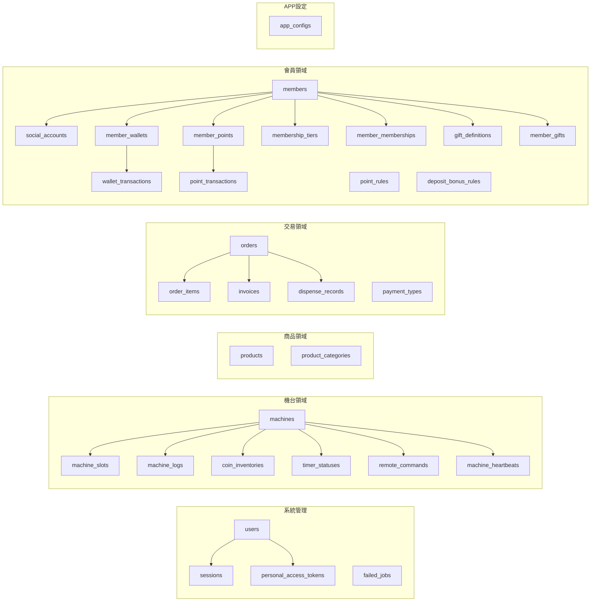

# Star Cloud — 智能販賣機管理平台技術架構規劃

> **目標**：為上千至上萬台智能販賣機建構集中式管理後台，承接所有機台透過 API 回寫的資料，並提供完整的營運管理介面。

---

## 一、系統架構全景

```
                        ┌──────────────────────────────────────────────┐
                        │            Star Cloud 管理後台                │
                        │     (Laravel 12 + Blade + Tailwind)          │
                        │  ┌──────────┐  ┌──────────┐  ┌───────────┐  │
                        │  │ 儀表板    │  │ 機台管理  │  │ 銷售分析   │  │
                        │  │ Dashboard │  │ Machines  │  │ Analytics  │  │
                        │  └──────────┘  └──────────┘  └───────────┘  │
                        │  ┌──────────┐  ┌──────────┐  ┌───────────┐  │
                        │  │ 倉庫管理  │  │ 會員系統  │  │ 遠端操控   │  │
                        │  │Warehouses │  │ Members   │  │  Remote    │  │
                        │  └──────────┘  └──────────┘  └───────────┘  │
                        └──────────┬───────────────┬───────────────────┘
                                   │  Web Routes   │
                                   │  (Blade SSR)  │
                        ┌──────────┴───────────────┴───────────────────┐
                        │              Laravel Application              │
                        │                                               │
                        │  Controllers → Services → Models → MySQL     │
                        │                                               │
                        └──────┬────────────────────┬──────────────────┘
                               │                    │
                    ┌──────────┴────┐       ┌───────┴───────┐
                    │  API Routes   │       │  Redis Queue  │
                    │  /api/v1/app  │       │  (異步處理)    │
                    └──────┬────────┘       └───────┬───────┘
                           │                        │
                    ┌──────┴────────┐       ┌───────┴───────┐
                    │ API Controller│──────►│   Jobs        │
                    │ (驗證 + 分派) │ dispatch│ (Worker 執行) │
                    └───────────────┘       └───────┬───────┘
                           ▲                        │
          ┌────────────────┤                        ▼
          │                │                 ┌──────────────┐
    ┌─────┴─────┐    ┌────┴─────┐           │   Services   │
    │ 販賣機 #1  │    │販賣機 #N │           │  (業務邏輯)   │
    │  B010      │    │  B600    │           └──────┬───────┘
    │  B600      │    │  B602    │                  │
    │  B602      │    │  ...     │                  ▼
    └────────────┘    └──────────┘           ┌──────────────┐
                                             │    MySQL     │
                                             │  (持久化)    │
                                             └──────────────┘
```

---

## 二、技術棧確認

| 層級 | 技術 | 說明 |
|------|------|------|
| **後端框架** | PHP 8.5 / Laravel 12 | 單體架構，Blade SSR |
| **資料庫** | MySQL 8.0 | 資料持久化 |
| **快取/隊列** | Redis | B010 心跳、B600 金流等高頻 API 必須異步 |
| **前端視圖** | Blade + Tailwind CSS + Preline UI | 極簡奢華風 |
| **前端互動** | Alpine.js | 輕量 DOM 互動 |
| **建置工具** | Vite | 前端資源編譯 |
| **開發環境** | Laravel Sail (Docker) | 本地開發 |
| **IoT 通訊** | Redis Queue + Jobs | 異步寫入，避免 API 直連 DB |
| **認證** | Laravel Sanctum | 後台用 Session，API 用 Token |

---

## 三、多租戶與權限架構 (Multi-Tenant RBAC)

為支援系統管理員（內部營運）與租戶（客戶公司及子帳號）的雙層管理模式，平台採用以下三層級權限隔離架構：

### 3.1 租戶隔離層 (Tenant Isolation)
*   **核心機制**：導入 `companies` 資料表作為租戶實體，所有歸屬於客戶的資源（`users`, `machines` 等）均需綁定 `company_id`。
*   **身份判定**：
    *   **系統管理員 (內部)**：`company_id = null`，具備跨租戶檢視與管理機台、設定全局參數的最高權限。
    *   **客戶端帳號 (租戶)**：`company_id` 有值，所有查詢（透過 Eloquent Global Scopes 或 Middleware）自動注入 `where('company_id', $user->company_id)`，達成資料物理隔離。

### 3.2 角色與權限層 (Roles & Permissions)
*   採用 `spatie/laravel-permission` 套件並進行多租戶改造。
*   **多租戶角色 (Tenant-Aware Roles)**：擴充 `roles` 表，加入 `company_id` 欄位。
    *   **系統預設角色** (`company_id = null`)：如 Super Admin, System Support。
    *   **客戶自建角色** (`company_id = N`)：如客戶建立的「分區維修員」、「會計」，確保客戶只能看見與分配屬於自己公司的角色給員工。
*   **權限 (Permissions)**：定義系統最小操作單位（如 `machine.view`, `user.create`），供角色綁定。

### 3.3 流程控制與防禦 (Flow Control)
*   **介面隔離**：依據身份動態隱藏/顯示系統級選單（例如「全站設定」、「合約管理」等多租戶不可見的功能）。
*   **越權防禦**：客戶創建子帳號時，後端必定強制攔截並覆寫 `user->company_id = Auth::user()->company_id`，確保子帳號牢牢綁在自己的公司名下。同時限制其只能撈與分配自己公司名下的 Role。

---

## 四、資料庫完整設計

### 4.1 資料表總覽

分為 **6 大領域**，共 **28 張表**：



### 4.2 需新增的資料表（Migration 設計）

> 以下為 API 分析後推導出的缺失表，搭配各 API 欄位產生對應。

---

#### 👑 多租戶與權限基礎表 (RBAC & Tenant)

##### 🆕 `companies` — 租戶/客戶主表
所有客戶端的資料邊界，用來實現資料物理隔離。

| 欄位 | 類型 | 說明 |
|------|------|------|
| `id` | BIGINT PK | — |
| `name` | VARCHAR(255) | 公司/組織名稱 |
| `tax_id` | VARCHAR(20) NULL | 統一編號 |
| `contact_name` | VARCHAR(100) NULL | 聯絡人姓名 |
| `contact_phone` | VARCHAR(50) NULL | 聯絡電話 |
| `status` | TINYINT DEFAULT 1 | 狀態 (1:啟用, 0:停用) |
| `valid_until` | DATE NULL | 合約使用期限 |
| `timestamps` | — | — |
| `deleted_at` | TIMESTAMP NULL | 軟刪除 (SoftDeletes) |

##### 🟡 `users` 表 — 需擴充欄位
將 Laravel 預設的使用者表與租戶綁定。

| 新增欄位 | 類型 | 說明 |
|----------|------|------|
| `company_id` | BIGINT FK NULL | → `companies` (NULL 代表系統管理員) |
| `status` | TINYINT DEFAULT 1 | 帳號狀態 (1:啟用, 0:停用) |

##### 🟡 `roles` 表 (Spatie 權限擴充)
Spatie 預設的 roles 表必須加上多租戶設計，確保留戶只能管理自己的角色。

| 新增/調整欄位 | 類型 | 說明 |
|----------|------|------|
| `company_id` | BIGINT FK NULL | → `companies` (NULL 代表系統全域角色) |
| **UNIQUE** | `(name, guard_name, company_id)` | 原套件無 `company_id`，需修改為複合唯一鍵 |

---

### 機台設定與參數模型 (Configuration & Parameters)

為了提升機台的可維護性與金流設定的靈活性，系統引入了以下結構：

#### 1. 機台型號設定表 (machine_models)
記錄系統支援的機台型號，供機台綁定基礎參數。

| 欄位 | 類型 | 說明 |
|------|------|------|
| `id` | BIGINT PK | — |
| `name` | VARCHAR(255) | 型號名稱 (例如: "B010-STD") |
| `company_id` | BIGINT FK | 所屬公司 (支援多租戶隔離) |
| `creator_id / updater_id` | BIGINT FK | 審計記錄 (建立者/修改者) |
| `timestamps` | — | — |

---

#### 2. 金流參數組合表 (payment_configs)
**範本化設計**：由公司建立支付參數組合範本，機台端選擇套用。

| 欄位 | 類型 | 說明 |
|------|------|------|
| `id` | BIGINT PK | — |
| `company_id` | BIGINT FK | 所屬公司 |
| `name` | VARCHAR(255) | 組合名稱 (例如: "玉山+綠界組合A") |
| `settings` | **JSON** | 儲存各支付平台 API Key (Ecpay, Esun, Tappay, LinePay 等) |
| `creator_id / updater_id` | BIGINT FK | 審計記錄 |
| `timestamps` | — | — |

---

#### 3. 機台主表擴充 (machines)
針對 `machines` 表擴充以下欄位以支援 IoT 通訊與進階營運設定：

| 類別 | 欄位 | 類型 | 說明 |
|------|------|------|------|
| **基礎識別** | `serial_no` | `VARCHAR` | 機台序號 (API 唯一識別碼) |
| **狀態監控** | `current_page` | `VARCHAR` | 機台當前畫面停留頁面 |
| | `door_status` | `VARCHAR` | 門禁狀態 (open/closed) |
| | `temperature` | `DECIMAL` | 機器溫度 (來自硬體回傳) |
| **金流設定** | `payment_config_id` | `BIGINT FK` | 關聯金流參數樣本 (`payment_configs`) |
| | `card_reader_seconds` | `INT` | 刷卡機秒數 (預設 30) |
| | `card_reader_checkout_time_1 / 2` | `TIME` | 卡機結帳清機時間 |
| | `payment_buffer_seconds` | `INT` | 金流回傳緩衝時間 (預設 5) |
| **硬體與營運**| `machine_model_id` | `BIGINT FK` | 關聯機台型號 (`machine_models`) |
| | `heating_start / end_time` | `TIME` | 加熱自動排程開啟與關閉時間 |
| | `card_reader_no / key_no` | `VARCHAR` | 刷卡機編號與鑰匙編號 |
| | `invoice_status` | `TINYINT` | 發票狀態 (0:不開, 1:預設捐, 2:預設不捐) |
| | `welcome_gift_enabled` | `BOOLEAN` | 來店禮開關 |
| | `member_system_enabled` | `BOOLEAN` | 會員系統開關 |
| | `is_spring_slot_1_10` ~ `60` | `BOOLEAN` | 貨道類型標記 (0=履帶, 1=彈簧) |
| **審計權限** | `company_id` | `BIGINT FK` | 關聯所屬公司 (租戶隔離) |
| | `creator_id / updater_id` | `BIGINT FK` | 建立者與最後修改者 ID |

---

#### 🆕 `products` — 商品資料

| 欄位 | 類型 | 說明 |
|------|------|------|
| `id` | BIGINT PK | — |
| `name` | VARCHAR(255) | 商品名稱 (預設語系) |
| `name_dictionary_key` | VARCHAR(100) NULL | 多語系字典鍵值 (對應 translations 表) |
| `sku` | VARCHAR(100) UNIQUE | 商品編號 |
| `price` | DECIMAL(10,2) | 售價 |
| `cost` | DECIMAL(10,2) NULL | 成本 |
| `category_id` | BIGINT FK NULL | → product_categories |
| `image` | VARCHAR NULL | 圖片 URL |
| `barcode` | VARCHAR NULL | 條碼 |
| `is_timer_product` | BOOLEAN | 是否為計時型商品 |
| `is_active` | BOOLEAN | 是否上架 |
| `timestamps` | — | — |

---

#### 🌐 多語系支援表 (i18n)

為了支援後台介面與 APP 端顯示的多語系內容（如商品名稱、分類名稱、系統提示），統一採用字典表架構。

##### 🆕 `translations` — 多語系字典表

| 欄位 | 類型 | 說明 |
|------|------|------|
| `id` | BIGINT PK | — |
| `group` | VARCHAR(50) | 分組 (例如: `product`, `category`, `system`) |
| `key` | VARCHAR(100) | 字典鍵值 (例如: `prod_name_001`) |
| `locale` | VARCHAR(10) | 語系代碼 (例如: `zh_TW`, `en_US`, `ja_JP`) |
| `value` | TEXT | 翻譯內容 |
| `timestamps` | — | — |
| **UNIQUE** | `(group, key, locale)` | 確保同一組鍵值在同一語系下唯一 |

> **多語系實作策略**：
> 1. **靜態文案**：後台介面的靜態文字直接使用 Laravel 內建的 `lang/` 目錄 (JSON 或 PHP 陣列)。
> 2. **動態資料**：資料庫內容（如商品名稱 `products.name`）保留預設語系供後台快速搜尋。同時新增 `name_dictionary_key`。當對接外部 APP 或前台需要多語系時，透過 API 關聯 `translations` 表，回傳當前語系對應的 `value`。

---

#### 🆕 `machine_slots` — 機台貨道

| 欄位 | 類型 | 說明 | 來源 |
|------|------|------|------|
| `id` | BIGINT PK | — | — |
| `machine_id` | BIGINT FK | → machines | B017, B055, B710 |
| `slot_no` | VARCHAR(20) | 貨道編號 | B017 `tid`, B710 `cid` |
| `product_id` | BIGINT FK NULL | → products | B710 `pid` |
| `stock` | INT DEFAULT 0 | 當前庫存 | B017 `num` |
| `max_stock` | INT DEFAULT 0 | 最大容量 | — |
| `is_active` | BOOLEAN | 是否啟用 | — |
| `timestamps` | — | — | — |
| **UNIQUE** | `(machine_id, slot_no)` | 複合唯一鍵 | — |

---

#### 🆕 `orders` — 訂單主表

| 欄位 | 類型 | 說明 | 來源 |
|------|------|------|------|
| `id` | BIGINT PK | — | — |
| `flow_id` | VARCHAR UNIQUE | Cloud 金流 ID | B600 response |
| `order_no` | VARCHAR | APP 訂單號 | B600 `req9` |
| `machine_id` | BIGINT FK | → machines | B600 `req2` |
| `member_id` | BIGINT FK NULL | → members | B650 關聯 |
| `payment_type` | SMALLINT | 金流類型碼 | B600 `req3` |
| `total_amount` | DECIMAL(10,2) | 消費金額 | B600 `req7` |
| `change_amount` | DECIMAL(10,2) | 找零 | B600 `req13` |
| `points_used` | INT DEFAULT 0 | 使用點數 | B600 `req14` |
| `original_amount` | DECIMAL(10,2) NULL | 折扣前金額 | B602 `req15` |
| `payment_status` | TINYINT | 0:失敗/1:成功 | B600 `req12` |
| `payment_request` | TEXT NULL | 金流送出 data | B600 `req4` |
| `payment_response` | TEXT NULL | 金流回傳 data | B600 `req5` |
| `member_barcode` | VARCHAR NULL | 會員條碼 | B600 `req10` |
| `invoice_info` | VARCHAR NULL | 發票歸戶 | B600 `req8` |
| `machine_time` | DATETIME NULL | 機台時間 | B600 `req11` |
| `timestamps` | — | — | — |
| **INDEX** | `(machine_id, created_at)` | 查詢最佳化 | — |
| **INDEX** | `(payment_type)` | 金流類型篩選 | — |

---

#### 🆕 `order_items` — 訂單明細

| 欄位 | 類型 | 說明 | 來源 |
|------|------|------|------|
| `id` | BIGINT PK | — | — |
| `order_id` | BIGINT FK | → orders | — |
| `product_id` | BIGINT FK | → products | B600 `req16.pid` |
| `quantity` | INT | 數量 | B600 `req16.num` |
| `unit_price` | DECIMAL(10,2) | 單價 | B600 `req16.amount` |
| `subtotal` | DECIMAL(10,2) | 小計 | 計算 |
| `timestamps` | — | — | — |

---

#### 🆕 `invoices` — 發票紀錄

| 欄位 | 類型 | 說明 | 來源 |
|------|------|------|------|
| `id` | BIGINT PK | — | — |
| `order_id` | BIGINT FK | → orders（via flow_id） | — |
| `flow_id` | VARCHAR | 金流 ID | B601 `req3` |
| `machine_id` | BIGINT FK | → machines | B601 `req2` |
| `rtn_code` | VARCHAR NULL | 回傳碼 | B601 `req4` |
| `rtn_msg` | VARCHAR NULL | 回傳訊息 | B601 `req5` |
| `invoice_no` | VARCHAR NULL | 發票號碼 | B601 `req6` |
| `invoice_date` | DATE NULL | 發票日期 | B601 `req7` |
| `random_number` | VARCHAR NULL | 隨機碼 | B601 `req8` |
| `love_code` | VARCHAR NULL | 愛心碼 | B601 `req9` |
| `timestamps` | — | — | — |

---

#### 🆕 `dispense_records` — 出貨紀錄

| 欄位 | 類型 | 說明 | 來源 |
|------|------|------|------|
| `id` | BIGINT PK | — | — |
| `order_id` | BIGINT FK NULL | → orders | — |
| `flow_id` | VARCHAR NULL | 金流 ID | B602 `req3` |
| `machine_id` | BIGINT FK | → machines | B602 `req2` |
| `product_id` | VARCHAR | 商品 ID | B602 `req5` |
| `slot_no` | VARCHAR | 貨道編號 | B602 `req6` |
| `amount` | DECIMAL(10,2) | 消費金額 | B602 `req7` |
| `remaining_stock` | INT NULL | 剩餘庫存 | B602 `req9` |
| `dispense_status` | TINYINT | 0:成功/1:失敗 | B602 `req13` |
| `member_barcode` | VARCHAR NULL | 會員條碼 | B602 `req10` |
| `machine_time` | DATETIME NULL | 機台時間 | B602 `req11` |
| `points_used` | INT DEFAULT 0 | 使用點數 | B602 `req16` |
| `timestamps` | — | — | — |

---

#### 🆕 `remote_commands` — 遠端指令佇列

| 欄位 | 類型 | 說明 | 來源 |
|------|------|------|------|
| `id` | BIGINT PK | — | — |
| `machine_id` | BIGINT FK | → machines | — |
| `command_type` | VARCHAR(50) | 指令類型 (reboot, lock, stock_update, dispense...) | B010, B017, B055 |
| `status` | ENUM | pending/sent/success/failed | — |
| `payload` | JSON NULL | 指令參數 (如: `{"slot_no": "A01", "num": 50}`) | — |
| `ttl` | INT DEFAULT 60 | 指令失效秒數 (尤其針對遠端出貨) | — |
| `executed_at` | TIMESTAMP NULL | 執行時間 | — |
| `timestamps` | — | — | — |

> 對應 B010 遠端指令（reboot, lock, unlock, checkout, dispense 等）以及 B055 遠端出貨。

---

#### 🆕 `coin_inventories` — 零錢機庫存

| 欄位 | 類型 | 說明 | 來源 |
|------|------|------|------|
| `id` | BIGINT PK | — | — |
| `machine_id` | BIGINT FK | → machines | B220 `machine` |
| `value_1` | INT DEFAULT 0 | 1 元 | B220 |
| `value_5` | INT DEFAULT 0 | 5 元 | B220 |
| `value_10` | INT DEFAULT 0 | 10 元 | B220 |
| `value_50` | INT DEFAULT 0 | 50 元 | B220 |
| `value_100` | INT DEFAULT 0 | 100 元 | B220 |
| `value_500` | INT DEFAULT 0 | 500 元 | B220 |
| `value_1000` | INT DEFAULT 0 | 1000 元 | B220 |
| `operator` | VARCHAR NULL | 操作人 (0=消費者) | B220 `account` |
| `timestamps` | — | — | — |

---

#### 🆕 `timer_statuses` — 計時器狀態

| 欄位 | 類型 | 說明 | 來源 |
|------|------|------|------|
| `id` | BIGINT PK | — | — |
| `machine_id` | BIGINT FK | → machines | B710 `req2` |
| `slot_no` | VARCHAR | 貨道 ID | B710 `cid` |
| `product_id` | BIGINT FK NULL | → products (0=未設定) | B710 `pid` |
| `status` | TINYINT | 0:未啟用/1:使用中/2:異常 | B710 `status` |
| `remaining_seconds` | INT | 剩餘秒數 | B710 `num` |
| `timestamps` | — | — | — |

---

#### 🆕 `payment_types` — 金流類型參照

| 欄位 | 類型 | 說明 |
|------|------|------|
| `id` | BIGINT PK | — |
| `code` | SMALLINT UNIQUE | 金流代碼 (1,2,3...120) |
| `name` | VARCHAR | 中文名稱 |
| `category` | VARCHAR | 大分類 |
| `is_active` | BOOLEAN | 是否啟用 |
| `timestamps` | — | — |

---

## 五、IoT API 路由設計

### 5.1 路由結構

```php
// routes/api.php
Route::prefix('v1/app')->middleware(['throttle:iot'])->group(function () {
    
    // B010 - 機台狀態上傳 & 指令撈回
    Route::post('/machine/status', [MachineStatusController::class, 'heartbeat']);
    
    // B017 - 遠端撈庫存
    Route::post('/machine/reload', [MachineStockController::class, 'reload']);
    
    // B055 - 遠端出貨
    Route::post('/machine/dispense', [DispenseController::class, 'getCommands']);
    Route::put('/machine/dispense', [DispenseController::class, 'updateStatus']);
    
    // B220 - 零錢機庫存
    Route::post('/coin/inventory', [CoinInventoryController::class, 'store']);
    
    // B600 - 消費金流
    Route::post('/transaction', [TransactionController::class, 'store']);
    
    // B601 - 發票回傳
    Route::post('/invoice', [InvoiceController::class, 'store']);
    
    // B602 - 出貨回傳
    Route::post('/dispense-record', [DispenseRecordController::class, 'store']);
    
    // B650 - 驗證會員
    Route::post('/member/verify', [MemberVerifyController::class, 'verify']);
    
    // B710 - 計時器狀態
    Route::post('/timer/status', [TimerStatusController::class, 'sync']);
});
```

### 5.2 處理管線

> [!IMPORTANT]
> 遵循 IoT 通訊技能規範：**嚴禁** API Controller 直接寫入 DB。

| API | 處理方式 | 原因 |
|-----|----------|------|
| B010 | **異步** (Redis Queue) | 最高頻，每台數秒一次 |
| B017 | **同步** (直接回應) | 低頻，需即時回傳庫存數據 |
| B055 GET | **同步** | 需即時回傳指令列表 |
| B055 PUT | **異步** | 出貨結果可背景處理 |
| B220 | **異步** | 庫存變動日誌可背景寫入 |
| B600 | **異步** | 高頻交易，核心數據 |
| B601 | **異步** | 發票資訊可背景寫入 |
| B602 | **異步** | 出貨紀錄可背景寫入 |
| B650 | **同步** | 需即時回傳驗證結果與折抵金額 |
| B710 | **異步** | 計時器狀態批量更新 |

---

## 六、後台模組 ↔ 資料表對應

| 後台模組（web.php） | 對應資料表 | 資料來源 API |
|---------------------|-----------|-------------|
| 1. 儀表板 Dashboard | orders, machines, dispense_records | 統計彙整 |
| 2. 會員管理 Members | members, social_accounts, member_wallets... | B650 |
| 3. 機台管理 Machines | machines, machine_logs, machine_slots | B010, B017 |
| 4. APP 管理 App | app_configs, timer_statuses | B710 |
| 5. 倉庫管理 Warehouses | products, machine_slots | B017, B602 |
| 6. 銷售管理 Sales | orders, order_items, dispense_records | B600, B602 |
| 7. 分析管理 Analysis | orders, dispense_records, coin_inventories | 全部 |
| 8. 稽核管理 Audit | orders, dispense_records | B600, B602 |
| 9. 資料設定 DataConfig | products, payment_types, users | — |
| 10. 遠端管理 Remote | remote_commands | B010, B055 |
| 11. Line 管理 | members (Line 綁定) | — |
| 12. 預約系統 Reservation | （未來擴充） | — |
| 13. 特殊權限 SpecialPerm | machines, app_configs | — |
| 14. 權限設定 Permission | users, roles | — |

---

## 七、效能預估與應對

### 10,000 台機台的流量預估

| API | 頻率 | 每秒請求量 (QPS) | 每日資料量 |
|-----|------|-----------------|-----------|
| B010 心跳 | 每 5 秒/台 | **~2,000** | ~173M 筆 |
| B600 金流 | 每筆交易 | ~10-50 | ~50K-200K 筆 |
| B602 出貨 | 每筆交易 | ~10-50 | ~50K-200K 筆 |
| B710 計時器 | 每 10 秒/台 | ~1,000 | ~86M 筆 |

### 應對策略

| 策略 | 實作方式 |
|------|----------|
| **Redis Queue 異步寫入** | 所有高頻 API 進 Queue，Worker 批量寫入 |
| **心跳資料瘦身** | B010 不逐筆寫 DB，僅更新 `machines` 表的即時欄位 + 異常時寫 log |
| **資料分區** | `orders` 和 `dispense_records` 按月份分區 |
| **索引策略** | 所有查詢欄位建立適當 INDEX（machine_id + created_at 複合索引） |
| **速率限制** | 單台機台 60 req/min，全站 100,000 req/min |
| **快取** | 機台列表、商品列表等低變動資料用 Redis Cache |

---

## 八、實作路線圖與預估時程

> [!NOTE]
> 為了保持規劃書的簡潔，詳細的開發時程、甘特圖、子選單拆解與 Phase 任務清單已獨立至專屬文件。

👉 **[查看詳細開發時程規劃 (development_schedule.md)](file:///home/mama/projects/star-cloud/docs/development_schedule.md)**

本專案預計總開發時程為 **17 ~ 18 週** (約 85 個工作天)，分為三個主要階段：
1. **Phase 1 (5天)**：基礎建設與 IoT API 串接。
2. **Phase 2 (50天)**：後台核心營運管理介面 (含遠端與倉庫管理)。
3. **Phase 3 (30天)**：進階分析報表與垂直功能模組。


---

## 九、目錄結構建議

```
app/
├── Http/Controllers/
│   ├── Admin/              ← 後台管理（已存在 14 模組）
│   └── Api/V1/
│       ├── App/            ← 機台 IoT API（新增）
│       │   ├── MachineStatusController.php   (B010)
│       │   ├── MachineStockController.php    (B017)
│       │   ├── DispenseController.php        (B055)
│       │   ├── CoinInventoryController.php   (B220)
│       │   ├── TransactionController.php     (B600)
│       │   ├── InvoiceController.php         (B601)
│       │   ├── DispenseRecordController.php  (B602)
│       │   ├── MemberVerifyController.php    (B650)
│       │   └── TimerStatusController.php     (B710)
│       ├── MemberController.php              ← 會員 API（已存在）
│       └── MachineController.php             ← 機台日誌（已存在）
├── Jobs/
│   └── Machine/            ← IoT 異步任務（新增）
│       ├── ProcessHeartbeat.php
│       ├── ProcessTransaction.php
│       ├── ProcessDispenseRecord.php
│       ├── ProcessInvoice.php
│       ├── ProcessCoinInventory.php
│       └── ProcessTimerStatus.php
├── Services/
│   └── Machine/            ← 業務邏輯（新增）
│       ├── HeartbeatService.php
│       ├── TransactionService.php
│       ├── DispenseService.php
│       └── MemberVerifyService.php
└── Models/
    ├── Machine/            ← 已存在
    │   ├── Machine.php
    │   └── MachineLog.php
    ├── Transaction/        ← 新增
    │   ├── Order.php
    │   ├── OrderItem.php
    │   ├── Invoice.php
    │   ├── DispenseRecord.php
    │   └── PaymentType.php
    ├── Product/            ← 新增
    │   ├── Product.php
    │   └── ProductCategory.php
    └── Member/             ← 已存在
```
